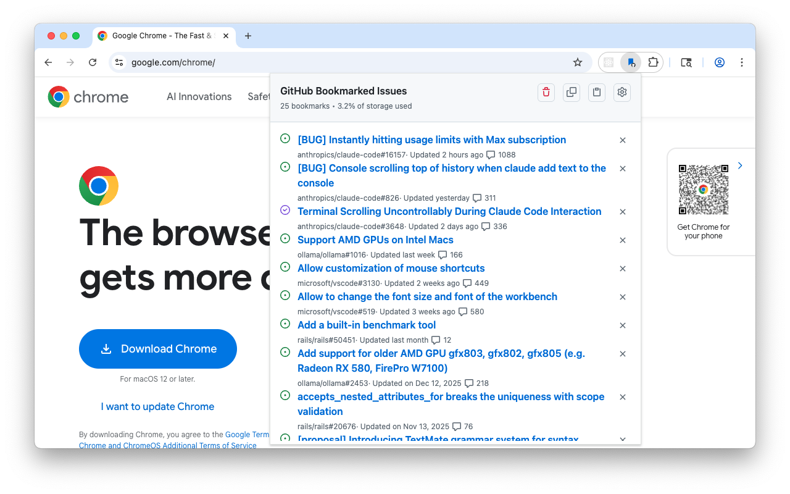
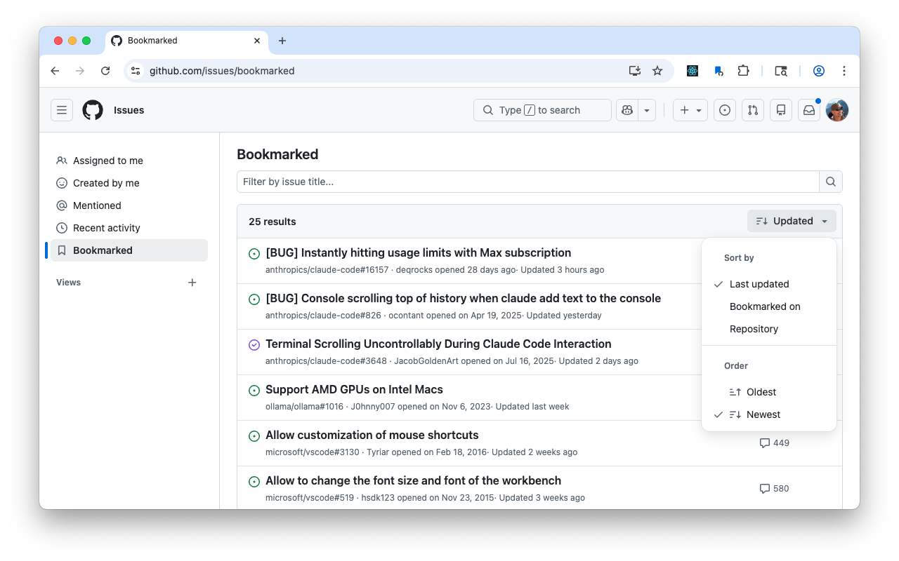
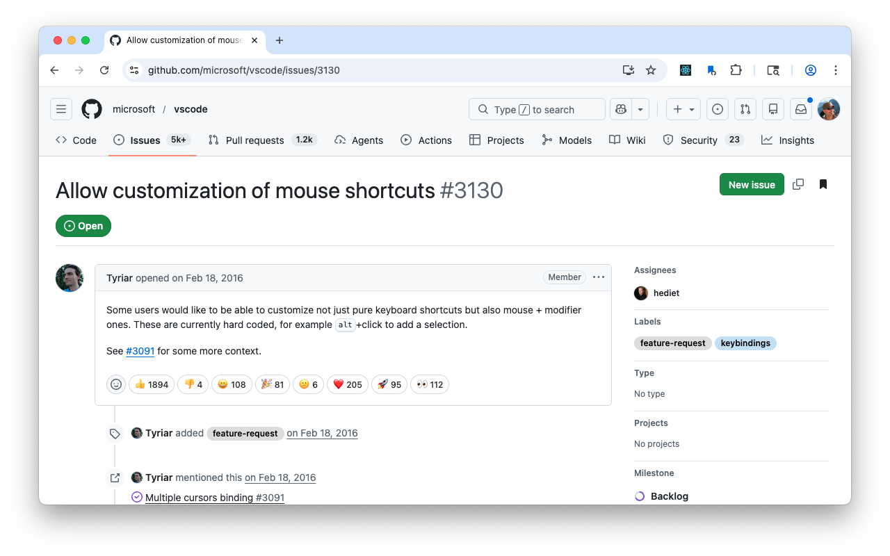
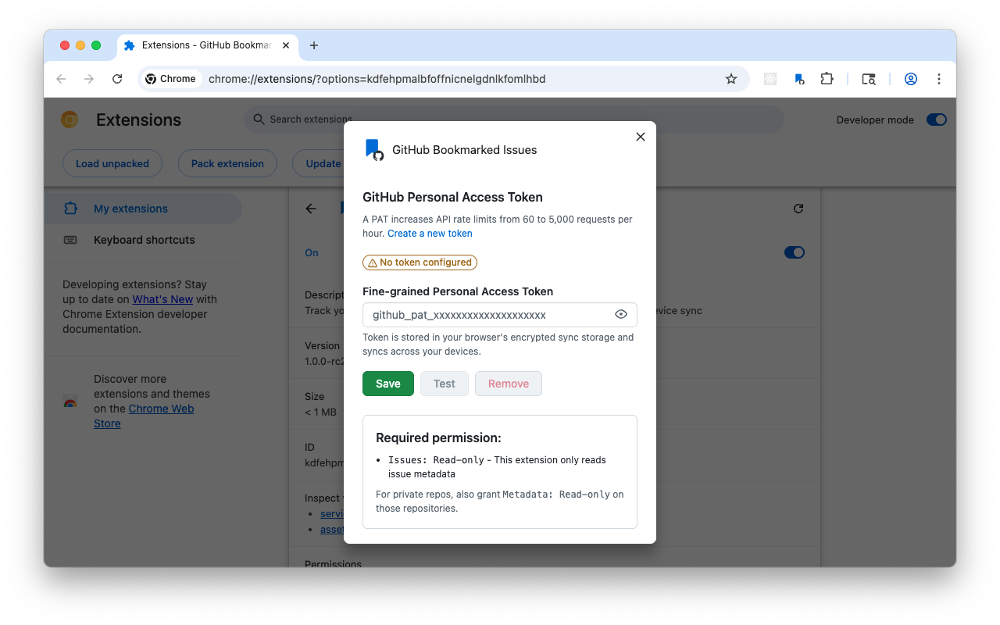

## Features

- Bookmark button on GitHub issue pages
- Bookmarked view - Custom view at `github.com/issues/bookmarked`
- Toolbar popup - View bookmarks, import/export as Markdown lists
- Options - Configure GitHub PAT for higher API rate limits

### Screenshots

<p>
  
  
  
  
</p>

## Install

- [Chrome Web Store](https://chromewebstore.google.com/detail/github-bookmarked-issues/kdfehpmalbfoffnicnelgdnlkfomlhbd)
- [Firefox Add-ons](https://addons.mozilla.org/en-CA/firefox/addon/github-bookmarked-issues/)

### Manual

Download the extension ZIP or XPI from [release assets](https://github.com/richardkmichael/github-bookmarked-issues/releases).

Chrome: `chrome://extensions`, enable `Developer mode`, `Load unpacked`, select the `build/chrome` directory
Firefox: `about:debugging#/runtime/this-firefox`, `Load temporary Add-on`, select the `XPI`.

## How it works

The Bookmarked view (at `github.com/issues/bookmarked`) uses GitHub's internal GraphQL API via
the content script — no rate limits for logged-in users.

The popup toolbar uses REST API, which is rate-limited. Configure a GitHub PAT in the
extension options for higher limits (5,000/hr vs 60/hr unauthenticated).

The Bookmarked view discovers GraphQL query hashes automatically by intercepting HTTP headers
when you navigate to any `github.com` page. This discovery only happens on `github.com` tabs.
If the Bookmarked view shows a rate-limit warning despite being logged in, navigate to any
GitHub page to trigger discovery, then reload the Bookmarked view.

See [GITHUB_OPERATION.md](GITHUB_OPERATION.md) for technical details.

## Development

See [BUILD.md](BUILD.md) for complete build instructions, development workflow, and testing setup.

Quick start:

```bash
npm install
npm run build        # Build both browsers
npm run dev:watch    # Auto-rebuild on changes
npm test             # Run Playwright tests
```

### Downloading CI visual test diffs

When visual tests fail in CI, diff images are uploaded as artifacts. Download them to compare
locally:

```bash
# Find the failed run
gh run list --status failure --limit 5

# Download Chrome visual diffs (Playwright test-results artifact)
gh run download <run-id> -n test-results-ubuntu-latest -D .tmp/ci-screenshots/ubuntu

# Download Firefox visual diffs (uploaded only on failure)
gh run download <run-id> -n firefox-screenshots-ubuntu-latest -D .tmp/ci-screenshots/ubuntu
```

Artifact names use the matrix OS: `macos-latest`, `ubuntu-latest`, `windows-latest` (Chrome only).

## Release and version

See [PUBLISH.md](PUBLISH.md) for complete versioning, CI, and store publishing information.

Releases are driven by annotated git tags (e.g., `v1.0.0`, `v1.0.0-rc3`).

The manifest `version` field is numeric-only (`X.Y.Z`) as required by both Chrome Web Store and
Firefox AMO. It is bumped manually for actual releases, not for pre-release (`-rcX`) tags.

Chrome supports a separate `version_name` field for human-readable version strings. The build
system auto-generates this from git state:

| Build context            | version_name                        |
|--------------------------|-------------------------------------|
| Tagged commit            | `1.0.0-rc1` (from tag `v1.0.0-rc1`) |
| Development (clean)      | `1.0.0-development_abc1234`         |
| Development (dirty)      | `1.0.0-development_abc1234-dirty`   |

Firefox has no equivalent to `version_name`; the build writes a `.version_name` file for use in
package filenames instead.

## Data Storage

| Key                    | Storage         | Description                          |
|------------------------|-----------------|--------------------------------------|
| `bookmarked_issues`    | `storage.sync`  | Bookmarks (syncs across devices)     |
| `github_pat`           | `storage.sync`  | PAT token (syncs across devices)     |
| `bookmarks_sort_order` | `storage.sync`  | Sort preference                      |
| `issue_cache`          | `storage.local` | Cached issue data (device-only, 5MB) |
| `discovered_hashes`    | `storage.sync`  | GraphQL query hashes (auto-updated)  |

## Privacy & Security

- No external servers - all data stays in browser storage
- No tracking or analytics
- Bookmark data syncs via browser account (Chrome/Firefox sync)
- Optional GitHub PAT stored in `storage.sync` if configured
- Issue cache stored in `storage.local` (device-only, not synced)
- Open source - inspect the code yourself

## Browser Compatibility

| Browser         | Status | Notes                       |
|-----------------|--------|-----------------------------|
| Chrome          | 123+   | Tested                      |
| Edge            | 123+   | Chromium-based, should work |
| Firefox         | 142+   | Tested                      |
| Firefox Android | -      | No `storage.sync` support   |
| Safari          | -      | Not investigated            |

## Known Limitations

- GraphQL discovery requires a github.com tab: The extension discovers GraphQL query hashes by intercepting HTTP headers from `github.com` page loads. Without discovery (e.g. if you haven't visited GitHub since installing), the Bookmarked view falls back to REST API with rate limits. Workaround: navigate to any `github.com` page, or configure a PAT in Settings.
- Popup uses the REST API: due to browser security restrictions (`Sec-Fetch-Site` header), the popup cannot use GitHub's internal GraphQL API. Without a PAT, it is limited to 60 requests/hour (unauthenticated). With many bookmarks, this can cause issues to fail to load. Configure a PAT in Settings for 5,000 requests/hour.
- Storage is per-browser, e.g. Google Account, Firefox Account
